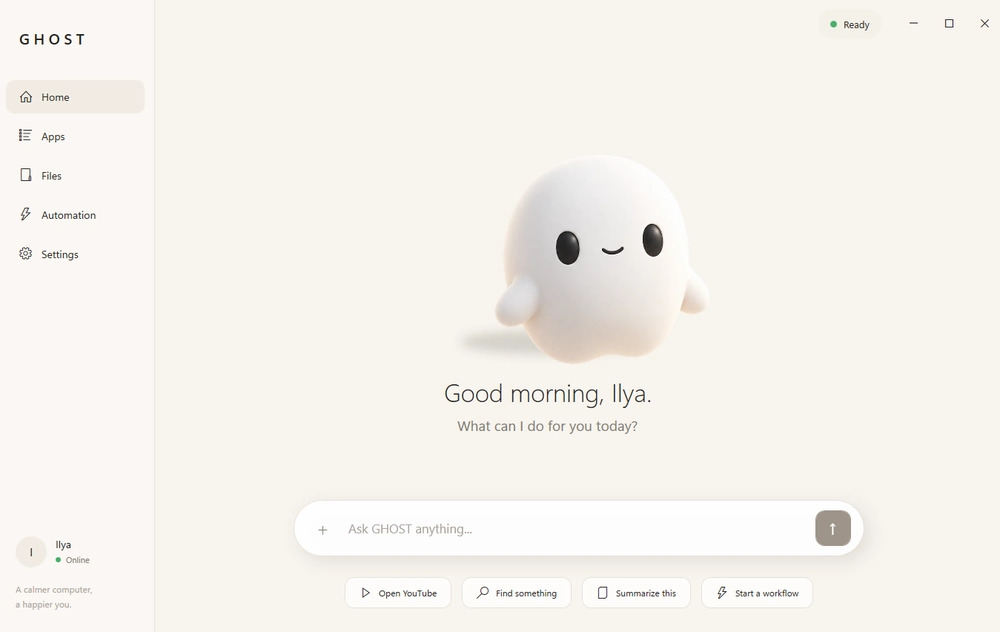
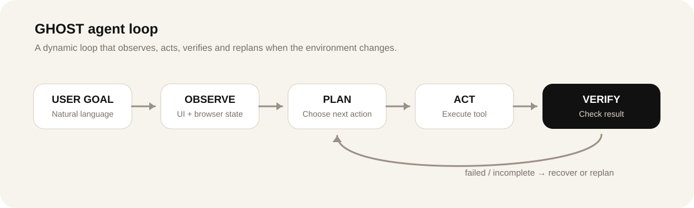

# GHOST Desktop AI Agent

GHOST is an experimental Windows **computer-use agent** designed to understand a user's goal, observe the current state of the computer and perform multi-step actions across desktop applications and the browser.

The project is focused on moving beyond fixed macros and recorded click sequences toward an agent that can decide what to do next, verify the result and adapt when the environment changes.

  

## Core loop

  

`Observe -> Plan -> Act -> Verify -> Replan`

The agent does not assume that an action succeeded. After meaningful actions it observes the environment again, checks the result and can retry, choose another target or re-plan.

## Current status

GHOST is an active personal R&D project, not a finished commercial product.

| Area | Status |
|---|---|
| Natural-language task input | Working prototype |
| Browser interaction | Working in selected scenarios |
| Desktop interaction | Working in selected scenarios |
| Dynamic planning | Active development |
| Semantic UI targeting | Active development |
| Result verification | Active development |
| Recovery / replanning | Active development |
| Sensitive-action confirmation | Architecture in progress |
| Voice interaction | Planned |

The goal of this repository is to show the architecture, engineering approach and development direction without presenting unfinished capabilities as complete.

## Architecture

GHOST is separated into several layers so that reasoning, observation and execution are not tightly coupled.

### Observation

The observation layer can collect structured information about the current environment, including:

- active applications and windows
- browser pages and tabs
- visible UI elements
- accessibility information
- text content
- focused controls
- recent actions and results

### Planning

The planner receives:

- the user's goal
- current environment state
- available actions
- execution history
- previous errors

It decides the next action instead of generating one long rigid script in advance.

### Action execution

The execution layer is built around reusable primitives such as:

- launch or focus an application
- navigate the browser
- click a UI element
- type text
- press keyboard shortcuts
- scroll
- read page content
- extract information
- interact with files
- wait for state changes

### Semantic target resolution

Reliable UI targeting is one of the main problems in desktop automation.

The project explores a layered strategy:

1. structured UI information
2. accessibility data
3. DOM data where available
4. semantic element matching
5. visual information
6. screen coordinates only as a fallback

### Verification and recovery

After an action, GHOST can observe the interface again and compare the resulting state with the expected outcome.

When the result is incomplete or wrong, the system can be designed to:

- retry
- select another target
- wait for the interface
- re-plan
- request user intervention

## Safety

Computer-use agents can trigger actions with real consequences.

Sensitive actions should be distinguishable from normal navigation and can require explicit confirmation before execution, especially for actions such as:

- sending messages
- publishing content
- making purchases
- deleting data
- changing security settings
- other irreversible actions

## Technology

Current technology direction:

- C#
- .NET
- WPF
- Windows UI Automation
- browser automation
- accessibility APIs
- LLM integration
- structured tool execution
- semantic UI targeting

Development uses AI-assisted engineering for architecture exploration, implementation, debugging and testing.

## Example task shape

A user could ask the agent to find information in one interface and move the result into another application.

A general agent flow would be:

1. understand the requested outcome
2. inspect the current state
3. locate the required application or page
4. identify the relevant UI target
5. perform the next action
6. observe the result
7. continue or re-plan
8. verify completion

The important part is that the workflow is generated from the goal and current state rather than replayed from a recorded macro.

## Development focus

Current work is centered on:

- reliable environment observation
- semantic UI understanding
- browser and desktop interaction
- dynamic planning
- execution verification
- recovery after failed actions
- safe handling of sensitive actions
- reducing dependence on fixed coordinates

## Roadmap

Planned improvements include:

- richer browser understanding
- stronger desktop application support
- improved semantic element resolution
- more reliable planning and recovery
- persistent task context
- structured skills
- voice interaction
- better execution logs
- expanded verification mechanisms

## Why I'm building it

Many real workflows still require people to move information between websites, desktop applications, CRM systems, spreadsheets and internal tools.

Traditional automation works well when every step is predictable. GHOST explores the harder case: workflows where the environment changes and the system needs to understand context, choose actions dynamically and recover when something unexpected happens.
